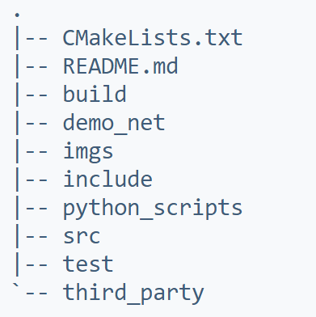

# SCNNI
**SCNNI(Simple Convolution Neural Network Inference Framework)**
- [SCNNI](#scnni)
  - [项目组成](#项目组成)
  - [设计思路](#设计思路)
  - [使用方法](#使用方法)
  - [下一步开发方向](#下一步开发方向)
    - [更新Tensor](#更新tensor)
    - [优化算子](#优化算子)
    - [优化执行](#优化执行)
    - [增加算子](#增加算子)
## 项目组成


主要实现代码在src文件夹下，include文件夹包含头文件。demo_net是demo的代码。test是单元测试文件夹。third_party包含第三方库，这里只有stb_image。python_scripts是生成单元测试网络的代码。
## 设计思路
我们没有使用ONNX这种通用的神经网络交换格式，因为考虑到ONNX格式比较难以读（对人类来说），不好进行开发和调试，并且ONNX格式的算子过于细碎。我们使用了ncnn的PNNX格式，PNNX格式有人类可读的网络定义，有与Pytorch一样的算子定义，非常符合开发一个玩具的要求。因此所有网络都需要先通过pnnx导出成pnnx的参数和权重，才能加载进框架执行。
* Tensor，底层的数据结构，目前只支持三维Tensor
* Blob，即操作数，是在运行时图中流动的"数据"，包含Tensor和一些用于构成图的元信息
* Layer，是运算真正的执行者，如LinearLayer，Conv2dLayer等
* Operator，即算子，是在运行时图中的计算单元，包含Layer和一些用于构成图元信息
* Graph，图，用于组织Operator和Blob，形成一个DAG，即计算图
* Executor，执行器，用于按照计算图执行推理过程

## 使用方法
需要第三方库 Eigen
```sh
apt install libeigen3-dev
```

编译：
```sh
cd SCNNI
mkdir build
cd build
cmake -DCMAKE_BUILD_TYPE=Release .. # 默认是debug模式
make
```

运行demo。这个demo是简单的卷积网络，可以判断图片中出现人脸的概率，可以在`demo_net/demo.cpp`中的`input_tensor.FromImage()`内修改图像路径。
```sh
cd build
make demo
./demo_net/demo
```
可以得到结果
```sh
0.976978 
0.0230217
```
表示出现人脸的概率为2.3%


## 下一步开发方向
### 更新Tensor
 * 因为设计失误，Tensor的性能并不理想。计划将Tensor中改用Eigen::TensorMap作为数据管理工具，当进行计算时，利用Eigen其他数据结构（例如Matrix）进行计算，可以大幅提升性能，并减小数据拷贝。
 * Tensor支持多种维度，而不必须是三维
### 优化算子
* 在初始化网络时，提前分配算子计算所用内存，减小在运行时分配内存占用时间
* 如果一个算子是“孤独的”，将算子的输入Tensor指针和输出Tensor指针指向同一Tensor，直接进行inplace的计算，减少内存消耗，减少数据拷贝占用的时间
* 使用OpenMP优化算子计算速度
### 优化执行
* 在执行时并行调度算子
### 增加算子
* 支持更多网络